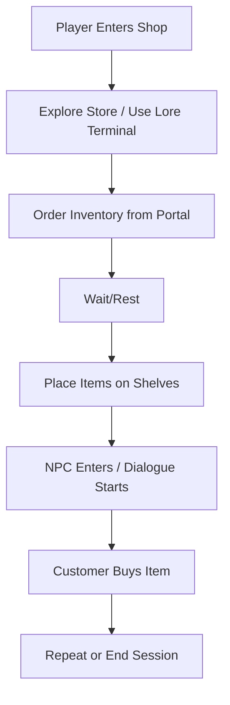

# 🎯 Tabletop Wargaming Shop Simulator – Alpha Game Design Document

## ✅ TL;DR Summary

| Category         | Summary                                                                 |
|------------------|-------------------------------------------------------------------------|
| **Core Goal**    | Deliver a playable Alpha build focused on lore interaction, dialogue, inventory restocking, and immersive shop mechanics. |
| **Target Users** | Internal dev + small closed playtest group for initial feedback.        |
| **Playtime Goal**| 15–20 minutes of coherent gameplay with optional replay value.         |
| **Visual Style** | Realistic, cozy shop interior; low clutter for readable UI.            |

---

## 🧱 1. Core Alpha Features

### 📚 Lore Codex System
- In-world object (e.g., terminal or shelf) opens a UI codex.
- Codex displays structured lore entries (e.g., factions, characters, product lines).
- Powered by `LoreKnowledgeBaseSO`.
- Entries have categories, short blurbs, and stylized headers.

### 💬 Basic Dialogue System
- Customer NPCs have predefined branching dialogue trees.
- Supports:
  - Greeting → lore question → response
  - Simple conditional lines (e.g., “You got that right!” if correct)
- Dialogue loaded from `DialogueTreeSO`.
- Future link: triggers rep gains or mood states.

### 🖥️ Inventory Ordering Portal
- In-game tablet or terminal opens a faux B2B supplier web UI.
- Displays available inventory with pricing, quantity, and delivery time.
- Purchase sends order, with delivery after a short wait or next in-game day.
- Delivered stock appears in backroom or shelf.

### 🛒 Restock/Sell Loop (Minimal)
- Players place items on shelves from received stock.
- Transaction occurs when customer interacts with stocked item (via trigger or timer).
- Money added to shop’s funds. Stock reduced.

### 🎖️ Simple Reputation Tracker (Optional)
- Each faction has a hidden or visible “rep score.”
- Reading lore or answering dialogue questions correctly increases this.
- Basic feedback: UI meter or debug log.

---

## 🧪 2. Gameplay Flow

---

## 🖥️ 3. Key UI Screens

| UI Element         | Purpose                              |
|---------------------|---------------------------------------|
| **Codex UI**        | Browse categorized lore entries       |
| **Dialogue Panel**  | Player dialogue choices & NPC response |
| **Supplier Portal** | View stock items, place orders        |
| **Shelf UI**        | Pick item from inventory, place on shelf |
| **Debug Panel**     | Toggle reputation, money, inventory   |

---

## 🏗️ 4. Systems Architecture Snapshot

| System                | Core Component(s)                 |
|------------------------|----------------------------------|
| Lore System            | `LoreKnowledgeBaseSO`, `CodexUIManager` |
| Dialogue System        | `DialogueTreeSO`, `DialogueManager`, `CustomerAI` |
| Inventory Ordering     | `SupplierPortalUI`, `InventorySystem`, `OrderManager` |
| Stocking & Sales       | `ShelfManager`, `StockSlot`, `TransactionSystem` |
| Reputation (Optional)  | `FactionRepTracker`, integrated with Lore and Dialogue |

---

## 🎨 5. Visual & Audio Direction (Alpha Scope)

| Aspect         | Description |
|----------------|-------------|
| **Style**      | Warm, inviting lighting, wood tones, realistic shop layout |
| **Assets**     | Painted minis, faction logos, shelf props, tablet/terminal UI |
| **Audio**      | Ambient store noise, subtle SFX (register ding, footsteps) |
| **UI Design**  | Retro-modern terminals, minimal clutter, text-focused |

---

## 📦 6. Content Scope for Alpha

| Content Type    | Quantity |
|------------------|---------|
| **Factions**      | 2 (e.g., Runeblades, Voidborn) |
| **Lore Entries**  | 5–8 per faction |
| **Dialogue Trees**| 2–3 total |
| **Supplier Items**| 6–10 (minis, rulebooks, paints) |
| **Customers**     | 1–2 static NPCs |
| **Shop Props**    | Shelves, display case, counter, codex terminal |

---

## 🧑‍🔬 7. Playtesting Goals

| Objective                              | Metrics / Notes |
|----------------------------------------|------------------|
| Do players understand how to explore lore? | Track codex interactions |
| Is the supplier portal intuitive to use?   | Observe order success/failure |
| Do dialogue interactions feel worthwhile?  | Feedback on tone, timing, content |
| Is there a sense of progression or purpose? | Track funds, rep, completed actions |
| Is the loop engaging enough for replay?    | Would players play again if expanded? |

---

## 🧱 8. Development Milestones

| Milestone        | Description                         |
|------------------|-------------------------------------|
| **MVP Refactor** | Clean up MVP codebase for modularity |
| **Codex System** | UI + SOs + asset pipeline            |
| **Dialogue System** | Load trees, trigger on NPC, test branches |
| **Supplier Portal** | Terminal + UI + stock order flow   |
| **Stock Loop**   | Shelf interaction + item depletion   |
| **Alpha Polish** | Light audio, lighting, scene setup   |
| **Playtest Build** | Export & document known limitations |
