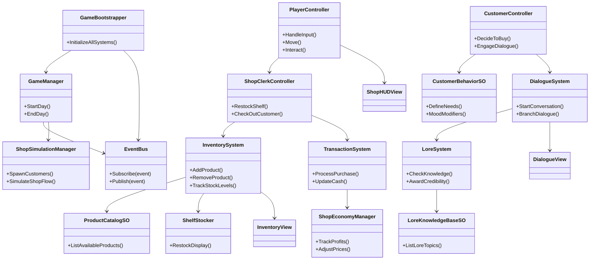

# Tabletop Wargaming Shop Simulator
## Game Design Document

---

## 1. Executive Summary

### 🎮 Game Overview

**Title:** Tabletop Wargaming Shop Simulator

**Genre:** First-Person Simulation + Tycoon + Narrative Immersion

**Platform:** PC (Steam, Itch.io) — Console possible post-launch

**Target Playtime per Run:** 10–30 hours (progressive sandbox)

**Setting Summary:** A lovingly recreated tabletop hobby store where the player manages inventory, customers, events, and lore knowledge across multiple fictional wargame universes in a stylized first-person environment.

---

### 💡 Core Concept

*"A cozy yet strategic shop simulator where deep nerd culture meets satisfying systems management. Grow your business, win your community, and master the lore of imaginary wars."*

The player runs a niche hobby store, selling miniatures, paints, terrain, and rulebooks while engaging with passionate customers, hosting in-store events, and learning the lore of in-universe games to better serve a diverse and demanding clientele.

---

### 🧠 Design Philosophy
- **Immersive familiarity:** Feels like a real hobby shop, full of inside jokes and character.
- **Knowledge matters:** Success depends not just on management but on understanding niche customer needs.
- **Community-first economy:** The shop thrives by becoming a hub for tournaments, collectors, and creators.
- **Replayable charm:** Flexible sandbox progression with seasonal events, metagame shifts, and expansion modules.

---

### 🎯 Target Audience

| Segment | Why It Resonates |
|---------|------------------|
| Hobbyists & Wargamers | Direct wish fulfillment, inside references |
| Sim Gamers | Deep, layered management systems |
| Story Lovers | Narrative side arcs, evolving relationships |
| Cozy Game Fans | Low-stress, satisfying task cycles |
| YouTube & Twitch Viewers | Satisfying to watch, easy to theme and roleplay |

---

### 🔑 Unique Selling Points (USPs)
1. **Original Lore Systems** – Entirely original IPs (e.g. Runeblades, Voidborn Armadas) with evolving community popularity and trivia interactions.
2. **Customer Knowledge Quizzing** – Earn bonuses by correctly answering questions about game lore, rules, or build advice.
3. **In-Store Event Systems** – Host tournaments, painting nights, trivia contests, and preview launches.
4. **Visual Narrative Storytelling** – Evolving shop interior, regulars with arcs, seasonal holidays and themes.
5. **Fully Diegetic Interface** – Everything happens inside your shop world — calendars, stock systems, events, and NPC interactions.

---

## 🎨 2. Game Vision & Identity

---

### 🔧 Core Design Pillars

| Pillar | Description |
|--------|-------------|
| 🧾 Simulation of Niche Retail | From shelf placement to last-minute inventory orders, everything is grounded in shop realism. |
| 📚 Lore-Driven Engagement | Knowing a game's factions and fluff is as valuable as knowing what's in stock. |
| 🎨 Creative Hobby Culture | Players paint models, organize events, and become a local tastemaker. |
| 🤝 Community Building | NPCs have preferences, stories, and rivalries. You're not just running a store—you're shaping a subculture. |

---

### 🎮 Key Influences

| Game | Influence Focus |
|------|----------------|
| TCG Card Shop Simulator | First-person shop simulation |
| Supermarket Simulator | Hands-on stocking and customer interaction |
| Game Dev Tycoon | Niche business meta progression |
| Potion Craft | Diegetic UI and tactile systems |
| VA-11 HALL-A | Dialog-driven character engagement |
| Two Point Hospital | Event scheduling and customer flow logic |

---

### 🧩 Core Mechanics & Features

#### 🛒 Shop Operations
- Open/close cycle, customer queue management, restocking, manual item pickup & placement.
- Hands-on interaction with shelving, pricing tags, and cash register.
- Receive stock deliveries, negotiate bulk discounts, manage limited editions.

#### 📦 Inventory & Supply
- Paints, miniatures, rulebooks, dice, terrain sets, starter kits, accessories.
- Supplier system with shifting prices, delays, exclusive content.
- Shelf visibility affects sales performance (e.g., eye-level positioning).

#### 📚 Lore & Faction Knowledge
- In-universe games with deep lore trees (e.g. Runeblades, Scrap Titans).
- Customers ask questions about rules, characters, or narrative.
- Answering correctly improves reputation and sales; wrong answers hurt prestige.

#### 🧑‍🤝‍🧑 Customer System
- Unique NPCs with traits (e.g., "new dad getting into Voidborn," "hyper-competitive teen").
- Regulars form relationships over time and react to the shop's direction.
- Dynamic feedback: "That's not how The Rustbound Codex interprets that rule!"

#### 🖌 Painting & Customization Corner
- Optional: Assemble or paint miniatures using a basic minigame.
- Sells higher-value kits or commissions for extra income.

#### 🧠 Event Scheduling
- Plan weekly events: tournaments, league nights, lore trivia.
- Choose rewards (e.g. prize packs, discount coupons).
- Events affect footfall, inventory stress, and rep with local communities.

#### 🧰 Expansion & Theming
- Upgrade from cramped store to multi-room nerd paradise.
- Theme areas by in-universe game, e.g. Fantasy Corner, Sci-Fi Sector.
- Hire specialist staff (e.g. tournament judge, lore master, terrain builder).

#### 💬 Narrative & Emergent Worldbuilding
- Regulars and rival stores develop over time.
- Story arcs include sponsor disputes, lost shipments, local scandals, game company collapses, indie dev launches.
- Procedurally triggered stories based on player choices.

#### 🧾 In-Game Systems
- Diegetic calendar, order forms, promo posters
- Seasonal trends: summer campaigns, Christmas rush, new faction releases
- In-game device for online orders and forums (meta-story via message boards)

---

### 🎭 Tone & Emotional Experience

Players should feel:
- **Welcomed & immersed:** Like their favorite local nerd shop, but even better.
- **Proudly nerdy:** Trivia, deep cuts, and playful in-jokes create a rich cultural world.
- **Invested in community:** Regulars start to feel like friends. Events have stakes.
- **Organized & productive:** Satisfying to get things done, hit goals, and plan weeks.
- **Surprised:** Unexpected customer stories or game launches shake up strategies.

---

### 🧱 Narrative & World Identity
- Entirely original IPs for games: Runeblades, Voidborn Armadas, Scrap Titans, Kingsgrave.
- Dynamic faction popularity cycles, cross-game rivalries, community rumors.
- Player reputation and shop culture ripple into stories (e.g., forum posts, news blurbs, exclusive invites).

---

## 🔄 3. Core Game Loops

---

### ⚙️ CORE LOOP — 30–60 seconds

**Customer enters → Asks question / Buys → Serve or engage → Restock or resolve**

**Purpose:** Moment-to-moment gameplay centered on direct interaction with the shop world and its inhabitants.

**Key Activities:**
- Recommend product
- Answer trivia
- Scan and bag purchase
- Tidy or restock shelf

**Design Goals:**
- Tactile, hands-on feel
- Every action contributes to immersion and shop success
- Humor and character keep things dynamic

---

### 🧰 SESSION LOOP — 5–15 minutes

**Manage day → Place orders → Host event → Assess stock/performance**

**Purpose:** Captures a "day in the shop." Focuses on resource allocation, inventory strategy, and customer flow.

**Key Activities:**
- Plan and adjust stock orders
- Run special events
- Deal with unexpected issues (shipment lost, customer dispute)
- Expand reputation with game factions

**Design Goals:**
- Strategic rhythm with optional stress
- Encourages forward planning and adaptation
- Build personal shop narrative

---

### 🧠 META LOOP — 1–10+ hours

**Expand shop → Build community → Develop brand identity → Survive and thrive**

**Purpose:** Governs overall player progression and long-term engagement through growth, unlocks, and replay.

**Key Activities:**
- Customize shop space and layout
- Unlock new fictional universes and events
- Hire, train, and roleplay with staff
- Gain prestige in the local and national gaming scene

**Design Goals:**
- Deep replayability with personalized progression
- Narrative systems that reward curiosity and care
- Space for roleplaying and creativity

---

## 🎯 4. Player Experience Journey

This section outlines the emotional and cognitive experience of a typical player as they move through their first session and beyond. It maps how player perception evolves with growing familiarity and mastery.

---

### 📘 Staged Player Journey

| Time | Player Experience | Design Objective |
|------|------------------|------------------|
| Minute 1 | "I'm in an actual miniature shop? This feels cool." | Deliver immediate immersion through a tactile, nostalgic shop environment. |
| Minute 10 | "I can set prices and talk to customers? This is more in-depth than I thought." | Reveal the game's mix of tycoon mechanics and social interactions. |
| Hour 1 | "I've created a mini-store meta with sales, hobby nights, and lore debates." | Establish agency through personalization and layered systems. |
| Hour 3+ | "What if I ran a lore-focused shop with ultra-rare models and narrative events?" | Encourage roleplay and emergent business styles through dynamic systems and content diversity. |

---

### 🧠 Cognitive & Emotional Flow

This journey focuses on the layered emotional engagement the player experiences:
1. **Nostalgia & Immersion** – "I feel like I'm back in my local tabletop shop."
2. **Discovery** – "I didn't expect this much detail in pricing, stock, and lore!"
3. **Mastery** – "I know how to manage customers, trends, and my inventory well."
4. **Expression** – "My shop has its own identity and cult following."
5. **Ownership & Replayability** – "I want to try a new approach next time."

---

### 🚀 Progression Experience Touchpoints

| Trigger | Player Realization | Supporting Systems |
|---------|-------------------|-------------------|
| Answering a lore question correctly | "That improved my shop's rep!" | Dialogue mini-game, lore database, rep system |
| Stocking a rare or trending game | "My profits just shot up!" | Inventory demand system, sales history, trend events |
| Organizing a hobby night or tournament | "Customers are coming in droves!" | Event calendar system, foot traffic boosts |
| Losing reputation after poor service | "I need to hire staff or get better at managing." | Staff hiring, multitasking challenge, time management loop |
| Reaching prestige level or unlocking new factions | "I'm building a tabletop empire." | Prestige/expansion system, lore unlocks, new inventory tiers |

---

### 🌀 Design Implications
- The first 10 minutes must deliver immersion and novelty without overwhelming the player.
- Players must feel clever for discovering efficient shop layouts, pricing, and sales strategies.
- The game rewards emergent narrative roleplay and multiple viable shop archetypes (e.g., budget-focused, lore-centric, elite boutique).
- Progression arcs should offer persistent improvement while encouraging replay or expansion.

---

## 📅 5. Phase Development Roadmap

| Phase | Game State & Description | Key Systems | Key Assets | Outcomes | Why It's Fun | What's Missing (Next Phase) |
|-------|-------------------------|-------------|------------|----------|--------------|---------------------------|
| Phase 1: Core Movement & Shop Layout | Player can move around a basic 3D shop, place furniture and shelves, walk to the register. | PlayerController, ShopLayoutManager, ShelfObject, InteractableSystem | Shop prefab, counter, shelf mesh, placeholder UI | First-person navigation feels grounded. Shop layout personalization introduced. | Immediate immersion + sense of ownership. Feels like your own space. | No customers or economic systems. Shop is inert. |
| Phase 2: Inventory Management System | Items can be stocked, placed, and priced. Player can view and restock inventory. | InventorySystem, ItemSO, ShelfSlot, PricingUI, StockManager | Model kits, faction boxes, item UIs, price tags | Core tycoon mechanic introduced. Pricing and placement affect perception. | Feels like running a real shop. Inventory management loop established. | No customer simulation or economic feedback. |
| Phase 3: Basic Customer AI & Sales Flow | Customers enter the shop, browse, buy, and leave. Basic behavior logic with cash interaction. | CustomerAI, CustomerSpawner, PurchaseSystem, CashRegisterUI | Customer models, animations, shopping path | The shop comes alive. The first loop of stocking → selling → restocking is complete. | Reactive environment makes your decisions matter. | Customers feel robotic. No dialogue, no nuanced behavior. |
| Phase 4: Reputation System + Shop Expansion | Customer satisfaction affects rep. High rep unlocks décor, shelf types, and new factions. | ReputationSystem, UnlockManager, ExpansionTriggers, ProgressionTracker | Rep bar, faction posters, unlock animations | Meaningful progression loop. Good service creates real advantages. | Player sees value in play style. Growth is visible and satisfying. | No lore or narrative systems. Lacks storytelling hook. |
| Phase 5: Lore Database + Dialogue Mini-Game | Customers ask lore questions; correct answers boost rep and sales. | DialogueSystem, LoreDatabaseSO, LoreQuizManager | Dialogue UI, trivia UI, customer queries | Adds roleplay, lore, and expertise-based gameplay. Unique genre twist. | You get rewarded for knowing your own fictional world. | Lore is static. Questions repeat. Needs scalability and narrative injection. |
| Phase 6: Dynamic Events + Calendar System | In-game events like sales, tournaments, and holidays affect traffic and interest. | CalendarSystem, EventTriggerSO, EventManager | Event posters, hobby night assets, UI prompts | Planning becomes part of the game. Different strategies suit different events. | Reactive systems make the world feel alive. | Still single shop. No late-game scale or multi-shop ambition. |
| Phase 7: Staff Hiring + Multitasking Systems | Hire and assign staff to restock, answer lore, or manage the register. | StaffManager, AIBehavior, ShiftScheduleSystem | Staff models, scheduling UI, employee traits | Deepens simulation and frees player to prioritize. Adds emergent chaos. | Delegation unlocks new player strategies. Staff stories possible. | No fail state or advanced player goals yet. |
| Phase 8: Custom Lore Universe Expansion | Players unlock custom campaigns, factions, and mini-worlds. Lore debates and events reflect this world. | FictionalUniverseManager, FactionSO, LorePackGenerator, WorldSeedSystem | Lore writing tool, faction builder UI, lore mission trees | Monetizable UGC. World-building becomes a core loop. Players feel like creators. | Long-tail engagement and replayability. | Needs quality of life and polish for final release. |
| Phase 9: Save System, Polish & Monetization Hooks | Game saves state, analytics implemented, monetization hooks for DLCs or UGC packs. | SaveSystem, AnalyticsManager, DLCTriggerSystem | Save/load UI, shop stats dashboard, unlock menus | Game feels complete, stable, and ready for players. | Feels like a living game. Ready for Steam EA. | Additional content roadmap. Long-term support planning. |

---

## 6. Systems Architecture (Tabletop Wargaming Shop Simulator)

### 🧠 6.1 System Overview

The game uses a modular, event-driven architecture split into logical subsystems:

- **Core Management**: Manages game flow, time simulation, customer spawning (`GameManager`, `ShopSimulationManager`, `GameBootstrapper`).
- **Player Interaction**: Handles player input and in-world interactions (`PlayerController`, `ShopClerkController`, `InteractionSystem`).
- **Inventory & Product System**: Defines and tracks shop inventory, stock levels, and pricing (`InventorySystem`, `ProductCatalogSO`, `ShelfStocker`).
- **Customer AI**: Simulates customer behavior, needs, and responses to stock, lore, and pricing (`CustomerController`, `CustomerBehaviorSO`).
- **Dialogue & Lore**: Manages customer interactions, lore discussions, knowledge checks, and narrative branching (`DialogueSystem`, `LoreSystem`, `LoreKnowledgeBaseSO`).
- **Sales & Transactions**: Handles buying/selling items, checkout, and shop finances (`TransactionSystem`, `CashRegister`, `ShopEconomyManager`).
- **UI & Feedback**: Displays inventory, sales reports, dialogues, and customer mood (`ShopHUDView`, `DialogueView`, `InventoryView`).
- **Data & Events**: Uses ScriptableObjects to store product data, customer types, and events (`GameEventSO`, `ProductSO`, `CustomerTypeSO`).

This design emphasizes extensibility and supports emergent systems such as customer satisfaction loops and player knowledge interactions.

### 🧰 6.2 Class Diagram (Mermaid)

### 🧩 6.X Core Code Architecture Approaches

- **🧠 Event-Driven Architecture**: All major systems publish and subscribe to runtime events via `EventBus` or `GameEventSO`, reducing coupling.
- **🧱 MVC (Model-View-Controller)**: Used in the UI and shop data layers, separating game state, UI, and logic. Examples: `InventoryView`, `DialogueController`.
- **📦 ScriptableObject-Driven Configuration**: Products, customers, and lore entries are stored in editable `ProductSO`, `CustomerTypeSO`, and `LoreKnowledgeBaseSO` objects.
- **🔌 Interface-Based Design**: Interfaces like `IInteractable`, `IPurchasable`, `IKnowledgeable` maintain modularity and allow mocking.
- **⚙️ Composition Over Inheritance**: Roles and behaviors (e.g., restocking, engaging, wandering) are composed into entities rather than inherited.
- **📊 Data-Driven Behavior**: Dialogue trees, product behaviors, and customer actions are driven from external data assets.
- **🧪 Test-First Modularization**: Systems are tested via mock events and testable input sequences.

### 🔄 6.3 Gameplay Event Flow Examples

#### 🛍️ Purchase Flow

1. Customer selects product.
2. Approaches checkout → triggers `CustomerAtRegisterEvent`.
3. `TransactionSystem` processes item and deducts from inventory.
4. `ShopEconomyManager` updates revenue.
5. Customer leaves → emits `CustomerExitedEvent`.

#### 💬 Lore Interaction Flow

1. Customer asks lore question.
2. `DialogueSystem` triggers player response UI.
3. `LoreSystem` evaluates correctness against `LoreKnowledgeBaseSO`.
4. Player gains/loses credibility based on accuracy.
5. Affects future customer trust/satisfaction.

#### 📈 Day Cycle & Profit Loop

1. Morning → inventory and pricing phase.
2. Daytime → customers flow in, shop runs.
3. Night → display profit/loss, shop feedback.
4. Use profit to expand stock, unlock premium lines.

### 📦 6.4 Data-Driven Architecture

#### 📊 Core Data Types

| **Data Type** | **Purpose** | **Format** |
|---------------|-------------|------------|
| `ProductSO` | Defines name, price, stock, type, rarity | ScriptableObject |
| `CustomerTypeSO` | Defines customer personas, interests, patience | ScriptableObject |
| `LoreKnowledgeBaseSO` | Lore snippets, questions, answers | ScriptableObject |
| `DialogueTreeSO` | Dialogue nodes and branching logic | ScriptableObject |
| `ShopSettingsData` | Price modifiers, opening hours, store size | SerializedAsset |
| `DailyMetricsData` | Sales totals, customer stats, reputation | JSON or CSV |
| `GameEventSO<T>` | Runtime event channels for messaging | ScriptableObject |
| `ShopUpgradeSO` | Unlockable shelves, counters, decor | ScriptableObject |
| `InventoryData` | Shop inventory at runtime | Serializable Class |

This modular, data-driven structure supports rapid iteration, scaling new products/customers easily, and enables narrative or seasonal expansions with minimal engineering overhead.

---

## 🗺️ 7. Content & Scope

This section outlines the playable content that defines the player's moment-to-moment gameplay, strategic depth, replayability, and aesthetic experience. Each content category is broken into Minimum, Target, and Stretch Goals to support modular development and future scalability.

The scope ensures a robust core experience with room for expansion, balancing production feasibility and player-driven depth.

---

### 📦 Content Scope Table

| Content Type | Minimum | Target | Stretch Goal | Design Intent |
|--------------|---------|--------|--------------|---------------|
| Product Types | 6 | 12 | 20 | Cover key categories: rulebooks, minis, paints, terrain, dice, boosters. |
| Customer Archetypes | 3 | 6 | 10 | Represent diverse gamer personas with varied needs and habits. |
| Store Upgrades | 4 | 8 | 15 | Drive progression via decor, shelving, stock management, checkout systems. |
| Events/Triggers | 3 | 6 | 12 | Local game nights, release days, influencer visits, theft, etc. |
| Dialogue/Lore Snippets | 10 | 25 | 50 | Embedded flavor via customer chatter, posters, and magazines. |
| Mini-Games | 0 | 1 | 3 | Paint station, quick battles, or stock sorting for immersion. |
| Competitor Interactions | 0 | 1 | 3 | Rival stores, sabotage rumors, market comparisons. |
| Playable Scenarios | 1 | 3 | 5 | Different shop locations or time periods (e.g., 1990s, sci-fi future). |
| Audio & SFX | 10 | 25 | 50 | Shop ambiance, customer chatter, sales sounds, UI feedback. |
| NPC Animations | 5 | 10 | 20 | Idle browsing, excited reactions, queue behavior. |

---

### 🧭 Content Development Philosophy
- **Minimum content** provides a satisfying vertical slice with economic flow, basic simulation, and immersive flavor.
- **Target content** rounds out the gameplay loop with increased complexity, customer diversity, and simulation depth.
- **Stretch content** unlocks thematic extensibility, post-launch updates, and community-based story evolution.

All categories are scoped for modular development, allowing teams to work in parallel across gameplay systems, UI, narrative, and world-building.

---

## 🧪 8. Technical Specifications

This section outlines the foundational technology stack, platform targets, and performance goals underpinning the Tabletop Shop Simulator. All choices aim to support rapid development, strong UX, and extensibility for future updates.

---

### ⚙️ Engine & Architecture

| Component | Specification | Notes |
|-----------|---------------|-------|
| Game Engine | Unity 2022.3 LTS | Stable long-term version for quick iteration and compatibility |
| Render Pipeline | Universal Render Pipeline (URP 3D) | Lightweight and flexible for stylized shop environments |
| Architecture | Modular, Event-Driven + ScriptableObjects | Supports simulation logic, customer behavior, and UI responsiveness |
| Input System | Unity Input System (New) | Remappable controls and gamepad support |
| Animation | Animator Controller + Blend Trees | NPC and object animations driven by state logic |
| Physics Engine | Unity 3D Physics (light use) | For pickup mechanics, queue shuffling, or product physics |
| UI System | Unity UI Toolkit + Canvas-Based UI | In-store overlays, POS systems, inventory management, customer queues |

---

### 💾 Save/Load System

| Component | Specification | Notes |
|-----------|---------------|-------|
| Serialization | JSON via Unity Serialization Utilities | Human-readable, supports debugging & analytics |
| Persistence Layer | Local file system | Cloud sync optional later |
| Supported Profiles | Single profile for MVP | Expandable to multi-profile and cloud save |
| Save Events | Event-driven (e.g., SaveDayEndedEvent) | Supports modular and reliable sync across systems |

---

### 🚀 Performance Targets

| Metric | Target Value | Goal |
|--------|--------------|------|
| Frame Rate | 60 FPS (locked) | Smooth simulation and UI updates |
| Active NPCs | ≤20 on-screen | Support queueing, browsing, events |
| Memory Footprint | <2 GB | Affordable for wide range of PCs |
| Loading Time | <5 seconds from main menu | Fast iteration and good UX |
| Build Size | <500 MB (compressed) | Fits within indie expectations, supports rapid updates |

---

### 🧰 Development Tooling

| Tool/Utility | Purpose |
|--------------|---------|
| Unity Profiler | Runtime diagnostics: memory, CPU, draw calls |
| Custom Simulation Debugger | Inspect customer queues, AI, restocks, daily logs |
| Unity Addressables | Memory-optimized loading of customer types and assets |
| Git + GitHub | Source control with branch-based workflows |
| Unity Test Framework | Systems-level testing for simulation and inventory |
| SO Configuration Tool | Editor tool for updating product/item definitions |

---

### 🔄 Extensibility & Porting Goals
- **Porting Strategy:** PC-first with future support for Steam Deck and consoles.
- **Post-Launch Support Plans:**
  - Event packs and scenario expansions (e.g., fantasy-only shop, pre-internet era)
  - Cosmetic DLCs for custom store branding and character skins
  - Modding support via asset and ScriptableObject injection

---

## 🎨 9. Art & Audio Direction

This section defines the visual and auditory identity of Tabletop Shop Simulator, conveying its grounded, nostalgic world and simulative feedback loops. The goal is to evoke a cozy, tactile hobby store atmosphere while reinforcing customer behavior, shopkeeping tasks, and subtle world-building through visual/audio storytelling.

---

### 🎨 Visual Style

| Aspect | Direction |
|--------|-----------|
| Theme | Hobbyist realism with stylized charm — inspired by real-world game stores with added warmth and lore hints |
| Color Palette | Natural woods, cool whites, cozy lighting with splashes of bold packaging colors (e.g., red boosters, neon green paints) |
| Silhouette Design | Distinct product silhouettes: boxed minis, paints, rulebooks, dice jars, booster packs — easy to recognize at a glance |
| Animation Style | Soft idle bobs for NPCs, subtle product interactions (grabbing, rotating), casual customer gestures |
| Destruction FX | Optional: box drops, paint spills, paper scatter — situational chaos rather than combat-style destruction |
| UI Style | Clean, modern store UI with receipts, stock overlays, POS terminals. Transparent, diegetic displays for immersion |

---

### 🧍‍♂️ Shop & NPC Visual Identity
- **Customers** wear street clothes, cosplay, or fan shirts to reflect different player types (e.g., Warhammer fans, Magic players, D&D nerds)
- **Store Decor** is upgradable: posters, banners, miniature displays, clean vs. cluttered shelves
- **Thematic Scenarios** change visual tone: e.g., neon-and-plastic for cyberpunk event, retro CRTs for 1990s flashbacks

---

### 🔊 Audio Direction

| Element | Audio Intent |
|---------|--------------|
| Customer Movement | Footsteps on wood/vinyl, idle chatter, shopping bags rustling |
| Product Interaction | Box snaps, dice rolls, card shuffles, paint pot clicks |
| UI Feedback | Subtle cash register dings, beeps, receipt zips, hover sounds |
| Ambience | Lo-fi music or retro game OSTs in background, occasional radio/podcast chatter |
| Store Events | Fanfares on big sales, murmurs during game nights, camera shutter for new arrivals |

---

### 🎧 Audio Layers & Interactivity
- **Layered FX:** Footsteps and product interactions vary by surface and object type.
- **Environment Reactivity:** Muffled sounds during quiet hours, louder atmospheres during events or crowd buildup.
- **Day Phases:** Ambience subtly shifts from quiet morning setup to bustling afternoon traffic to mellow closing time.
- **Narrative Moments:** Optional filtered voice lines or text-to-speech for quirky NPCs, fantasy customers, or competitors.

The art and audio of Tabletop Shop Simulator aim to immerse players in the cozy chaos of running a hobbyist haven, where every shelf, sale, and snarky NPC tells a story of the game store culture we love.

---

## 🎮 10. Feel Document

This section captures the intended game feel — the tactile, emotional, and sensory experience of being a store owner, hobbyist, and quiet world-builder. It prioritizes vibes, interactions, and personality over high-speed gameplay.

---

### 🏃 Movement Feel

| Sub-Element | Goal |
|-------------|------|
| Movement | Smooth, intentional locomotion — player movement feels grounded and controlled. |
| Pickup/Drop | Product interaction should feel snappy and clean, with satisfying audio and haptic feedback. |
| Queue/Checkout | Register interactions feel responsive; customer flow should be readable, not chaotic. |
| Navigation | Movement should balance efficiency with curiosity — players are rewarded for browsing their own shop. |
| Camera Control | Light mouse/joystick control for looking around shelves, close-up views on products. |

---

### 🛍️ Simulation Feel

| Sub-Element | Goal |
|-------------|------|
| Stock Management | Moving, rotating, and placing items should feel like a cozy tactile puzzle. |
| Customer Flow | Watching customers browse, react, and queue should be satisfying and comprehensible. |
| Progression | Upgrades (e.g., new shelves, rare stock) should feel visually and functionally impactful. |
| Daily Loop | Each day should feel distinct: slow mornings, peak-hour bursts, quirky events. |
| Event Interactions | Game nights and surprise events create dynamic energy shifts without requiring fast reflexes. |

---

### 📈 Emotional Flow

| Phase | Emotion |
|-------|---------|
| Opening Morning | Anticipation — "Let's see what kind of customers I get today." |
| First Sale | Satisfaction — "Nice, that booster sold fast!" |
| First Complaint | Tension — "Oh no, what did I forget to stock?" |
| First Upgrade | Motivation — "Now it really feels like my store." |
| Event Day | Excitement — "What will the cosplay competition bring?" |
| End of Day | Calm — "Time to restock and plan for tomorrow." |

---

The feel of this game is grounded in routine, immersion, and cozy control. It should feel like rolling dice in a friend's basement, but with the elegance of a modern sim — playful, personal, and quietly aspirational.